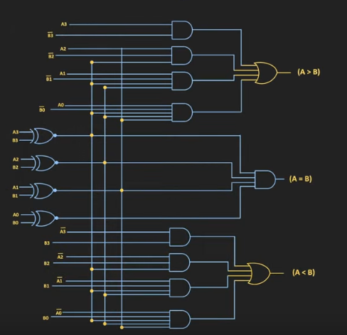

<h1 align="center">sub</h1>
<h2 align="center">🥺</h2>

Constructing arbitrary boolean circuits with IEEE-754 floating point subtraction. Inspired by [this beautiful blog post](https://orlp.net/blog/subtraction-is-functionally-complete/).


# Ambition

Construct an ALU using IEEE-754 subtraction.

## Current logic gates

* AND
    * supports a 4 input variant

* NAND

* OR
    * supports a 4 input variant

* NOR

* XOR

* XNOR

* NOT

Following the blog post, $True \triangleq +0.0$ and $False \triangleq -0.0$

A new type is defined to differentiate between our "Boolean" values and just a normal f32 or f64. Since we only really need +0.0 and -0.0, an f32 sufficed.

Sub defines the Fbit, our floating point booleans, as a simple type alliase for an f32.

```Rust

type Fbit = f32;
```

to check if two Fbits are equal it does not suffice to use the equality operator since

```Rust
assert_eq!(0.0, -0.0); // this does not panic!!!
```

for this you have to use the fbit_eq macro

```Rust
assert!(fbit_eq!(TRUE, TRUE));
assert!(fbit_eq!(FALSE, FALSE));
assert_ne!(fbit_eq!(TRUE, FALSE));
assert_ne!(fbit_eq!(FALSE, TRUE));
```

To cast an Fbit to a bool

```Rust
let a: Fbit = TRUE
let b: bool = to_bool(a);
```

To negate an Fbit,

```Rust
assert!(fbit_eq!(not(FALSE), TRUE));
```

there are also Fbit4 and Fbit8 types for 4 and 8 bit numbers using IEEE-754 subtraction.

```Rust
let a: u8 = 42;
let b: Fbit8 = to_fbit8(a)  // converts 42 to an equivalent array of 8 Fbits
let c: u8 = 1;
let d: Fbit4 = to_fbit4(c); // converts 1 to an array of 4 Fbits (panics if the input is outside the range of 4bit binary numbers)
```

these types can be easily used to construct 8-bit adders and the like.

For example, to construct a full 1-bit adder:

```Rust
use sub_rs::*;

fn full_1bit_adder(a: Fbit, b: Fbit, c: Fbit) -> (Fbit, Fbit) {
    (
        xor(xor(a,b), c),
        or(
            and(xor(a,b), c),
            and(a,b)
        )
    )
}

fn main() {
    // add 1 and 1 with 0 for the initial carry bit
    let (s,c) = full_1bit_adder(TRUE, TRUE, FALSE) // (FALSE, TRUE)
}
```

or checking whether an 8-bit number is even or odd

```Rust
// only need to check the lsb 5head
fn is_even(a: Fbit8) -> Fbit { not(a[0]) }

fn main() {
    let x: u8 = 42;
    let even = to_bool(is_even(to_fbit8(x)));
    if even {
        println!("{} is even according to IEEE-754 subtraction!", x)   
    } else {
        println!("{} is odd according to IEEE-754 subtraction!", x)   
    }
}
```

```console
> 42 is even according to IEEE-754 subtraction!
```

A fun example is constructing a 4-bit Magnitude Comparator. Here it is in all of its ~~horrific~~ beautiful glory

```Rust
/// A fully functional 4-bit Magnitude Comparator using IEEE-754 subtraction
pub fn mag_comp4(a: Fbit4, b: Fbit4) -> (Fbit, Fbit, Fbit) {
    let equals: Fbit = and4(
        xnor(a[0], b[0]),
        xnor(a[1], b[1]),
        xnor(a[2], b[2]),
        xnor(a[3], b[3]),
    );

    let a_greater: Fbit = or4(
        and(not(b[3]), a[3]),
        and(and(a[2], not(b[2])), xnor(a[3], b[3])),
        and4(a[1], not(b[1]), xnor(a[3], b[3]), xnor(a[2], b[2])),
        and(and4(a[0], not(b[0]), xnor(a[3], b[3]), xnor(a[2], b[2])), xnor(a[1], b[1]))
    );

    let a_lesser: Fbit = or4(
        and(b[3], not(a[3])),
        and(and(not(a[2]), b[2]), xnor(a[3], b[3])),
        and4(not(a[1]), b[1], xnor(a[3], b[3]), xnor(a[2], b[2])),
        and(and4(not(a[0]), b[0], xnor(a[3], b[3]), xnor(a[2], b[2])), xnor(a[1], b[1]))
    );

    (a_greater, equals, a_lesser)
}
```

more familiarly in circuit form,

<p align='center'>
    </img>
</p>


yes there is a lot of repetition but the compiler should take care of it :3

## testing

simply run

```console
> cargo test
```

this will test that the truth tables for the implemented IEEE logic gates are correct. 
